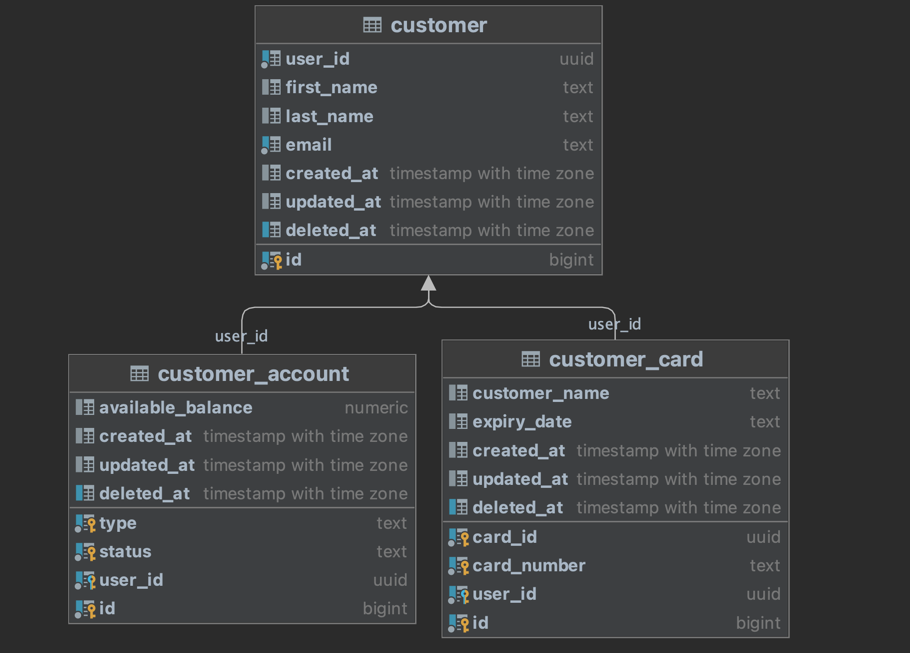
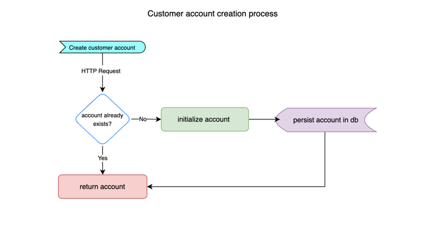
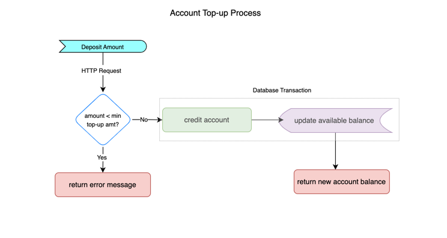

## Simple Bank Account

A simple REST microservice that can create a customer and customer account. A customer can have multiple bank accounts
and multiple Debit/Credit card numbers. The service supports account top-ups and account withdrawal functions.

### Key Objectives

- Creating a new customer
- Creating a new customer account
- Ability to perform a withdrawal and top up

### Project Architecture & Design

- The service follows a Domain Driven approach. Throughout the
  application,
  we can generally come with certain bounded contexts: (1) A **Customer**, whose main responsibility is to
  represent a real world customer, capable of making bank withdrawals and deposits (2) A **Customer Account** whose
  responsibility is to represent a customer's bank account details and status (3) **A Customer Card** whose main
  responsibility
  is to represent a customer's bank cards
- The service uses a `PostgreSQL` database for data persistence and has three tables (entities): (1) _customer_ table (2)
  _customer_account_ table (3) _customer_card_ table
- The relationship between the three entities is as shown below:




#### Process flows
##### 1. Customer Creation Process

##### 2. Account Creation Process

##### 3. Account Withdrawal Process

##### 4. Account Top-up Process


- More details of the service architecture and design can be found in the design [document](https://docs.google.com/document/d/1u1FJNDupqOmITXbt6NJswYqu67VOz-SdqxSEi9DMZrc/edit?usp=sharing)

### Installation, Building & Testing

#### 1. Cloning

Let's start by getting the application from `Github` to our local machine.

```bash
git clone https://github.com/gillerick/simple-bank-account
```

#### 2. Configuring

A configuration file already exists under the root path of the application. Its structure is shown below. Also, we
have made the provision to set the properties as `envs`. Go over to ``configs/yaml.go`` file to see this.

```yaml
app:
  host: "app-host"
  port: "app-port"
database:
  user: "db-user"
  password: "db-password"
  host: "db-host"
  port: "db-port"
  dbname: "db-name"
```

#### 3. Starting Docker compose

Run the command below to set up the dependencies and database.

```bash
$ docker-compose up
```

#### 4. Running the application

```bash
make run
```

If you see the logs below, your `Simple Bank Account` service was successfully set up.

```bash
INFO[0000] running db migrations                         source="migrations.go:10"
INFO[0000] db migrations ran successfully                source="migrations.go:17"
INFO[0000] server listening on address: 127.0.0.1, port: 8080  source="server.go:23"
```

#### API Usage

A description of the API and endpoints can be found in the design [documentation](https://docs.google.com/document/d/1u1FJNDupqOmITXbt6NJswYqu67VOz-SdqxSEi9DMZrc/edit?usp=sharing) under API section.

##### 1. Creating a customer

Curl request example

```curl
curl --location --request POST 'http://localhost:8080/user' \
--header 'Content-Type: application/json' \
--data-raw '{
    "first_name": "Gill",
    "last_name": "Erick",
    "email": "ogayogill95@gmail.com"
}'
```

Response example

```json
{
  "user_id": "54b819af-bc4d-442d-a361-a917adb6173a",
  "first_name": "Gill",
  "last_name": "Erick",
  "email": "ogayogill95@gmail.com",
  "Accounts": null,
  "Cards": null,
  "CreatedAt": "2022-11-14T22:33:48.794892+03:00",
  "UpdatedAt": "2022-11-14T22:33:48.794892+03:00",
  "DeletedAt": null
}
```

Database record(s)

```
+------------------------------------+----------+---------+---------------------+--+---------------------------------+---------------------------------+----------+
|user_id                             |first_name|last_name|email                |id|created_at                       |updated_at                       |deleted_at|
+------------------------------------+----------+---------+---------------------+--+---------------------------------+---------------------------------+----------+
|54b819af-bc4d-442d-a361-a917adb6173a|Gill      |Erick    |ogayogill95@gmail.com|1 |2022-11-14 19:33:48.794892 +00:00|2022-11-14 19:33:48.794892 +00:00|null      |
+------------------------------------+----------+---------+---------------------+--+---------------------------------+---------------------------------+----------+
```

##### 2. Creating a customer account without specifying account type

###### 2.1. `CURRENT` account type creation

Request example

```curl
curl --location --request POST 'http://localhost:8080/user/54b819af-bc4d-442d-a361-a917adb6173a/account' \
--data-raw '{
    "account_type":"CURRENT"
}'
```

Response example

```json
{
  "account_type": "CURRENT",
  "Status": "ACTIVE",
  "AvailableBalance": 0,
  "UserId": "43e81839-a159-4979-badf-cd0a96e3473c",
  "CreatedAt": "2022-11-14T22:55:46.292318+03:00",
  "UpdatedAt": "2022-11-14T22:55:46.292318+03:00",
  "DeletedAt": null
}
```

###### 2.2. `SAVINGS` account type creation

Request example

```curl
curl --location --request POST 'http://localhost:8080/user/54b819af-bc4d-442d-a361-a917adb6173a/account' \
--header 'Content-Type: application/json' \
--data-raw '{
    "account_type":"SAVINGS"
}'
```

Response example

```json
{
  "account_type": "SAVINGS",
  "Status": "ACTIVE",
  "AvailableBalance": 0,
  "UserId": "54b819af-bc4d-442d-a361-a917adb6173a",
  "ID": 2,
  "CreatedAt": "2022-11-14T23:17:13.975603+03:00",
  "UpdatedAt": "2022-11-14T23:17:13.975603+03:00",
  "DeletedAt": null
}
```

###### 2.3. Attempting to create a repeat account

Request example

```curl
curl --location --request POST 'http://localhost:8080/user/54b819af-bc4d-442d-a361-a917adb6173a/account' \
--header 'Content-Type: application/json' \
--data-raw '{
    "account_type":"SAVINGS"
}'
```

This will return with the current `SAVINGS` account for user `54b819af-bc4d-442d-a361-a917adb6173a` with no additional
account created in the database.

Database records(s)

```
+-------+------+-----------------+------------------------------------+--+---------------------------------+---------------------------------+----------+
|type   |status|available_balance|user_id                             |id|created_at                       |updated_at                       |deleted_at|
+-------+------+-----------------+------------------------------------+--+---------------------------------+---------------------------------+----------+
|SAVINGS|ACTIVE|0                |54b819af-bc4d-442d-a361-a917adb6173a|2 |2022-11-14 20:17:13.975603 +00:00|2022-11-14 20:17:13.975603 +00:00|null      |
|CURRENT|ACTIVE|0                |54b819af-bc4d-442d-a361-a917adb6173a|3 |2022-11-14 20:17:27.548399 +00:00|2022-11-14 20:17:27.548399 +00:00|null      |
+-------+------+-----------------+------------------------------------+--+---------------------------------+---------------------------------+----------+
```


