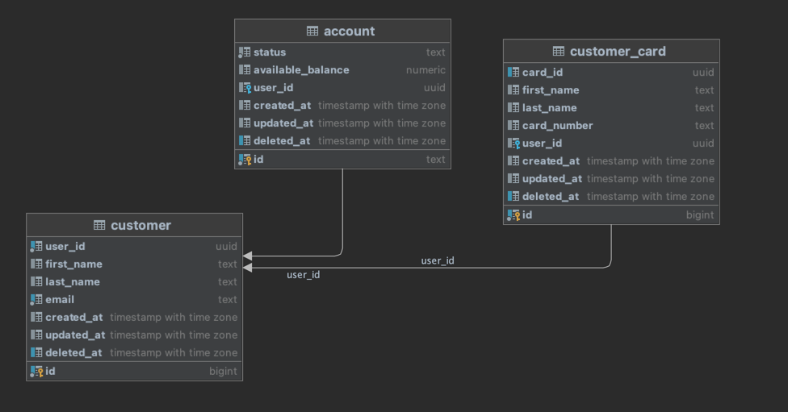

## Simple Bank Account

A simple REST microservice that can create a customer and customer account. A customer can have multiple bank accounts
and multiple Debit/Credit card numbers. The service supports account top-ups and account withdrawal functions.

### Key Objectives

- Creating a new customer
- Creating a new customer account
- Ability to perform a withdrawal and top up

### Project Architecture & Design

- The service follows a Domain Driven approach. Throughout the
  application,
  we can generally come with certain bounded contexts: (1) A **Customer**, whose main responsibility is to
  represent a real world customer, capable of making bank withdrawals and deposits (2) A **Customer Account** whose
  responsibility is to represent a customer's bank account details and status (3) **A Customer Card** whose main
  responsibility
  is to represent a customer's bank cards
- The service uses a `PostgreSQL` database for data persistence and has three tables (entities): (1) customer (2)
  account (3) customer_card
- The relationship between the three entities is as shown below:



### Installation, Building & Testing

#### 1. Cloning

Let's start by getting the application from `Github` to our local machine.

```bash
git clone https://github.com/gillerick/simple-bank-account
```

#### 2. Configuring

A configuration file already exists under the root path of the application. Its structure is shown below. Also, we
have made the provision to set the properties as `envs`. Go over to ``configs/yaml.go`` file to see this.

```yaml
app:
  host: "app-host"
  port: "app-port"
database:
  user: "db-user"
  password: "db-password"
  host: "db-host"
  port: "db-port"
  dbname: "db-name"
```

#### 3. Starting Docker compose

Run the command below to set up the dependencies and database.

```bash
$ docker-compose up
```

#### 4. Running the application

```bash
make run
```

If you see the logs below, your `Simple Bank Account` service was successfully set up.

```bash
INFO[0000] running db migrations                         source="migrations.go:10"
INFO[0000] db migrations ran successfully                source="migrations.go:17"
INFO[0000] server listening on address: 127.0.0.1, port: 8080  source="server.go:23"
```

#### API Usage

##### 1. Creating a customer

Curl request example

```curl
curl --location --request POST 'http://localhost:8080/user' \
--header 'Content-Type: application/json' \
--data-raw '{
    "first_name": "Gill",
    "last_name": "Erick",
    "email": "ogayogill95@gmail.com"
}'
```

Response example

```json
{
  "user_id": "c7e2671e-de09-47ae-8738-81bb4f923261",
  "first_name": "Gill",
  "last_name": "Erick",
  "email": "ogayogill95@gmail.com",
  "Account": null,
  "Card": null,
  "ID": 1,
  "CreatedAt": "2022-11-14T22:33:48.794892+03:00",
  "UpdatedAt": "2022-11-14T22:33:48.794892+03:00",
  "DeletedAt": null
}
```

Database record
```
+------------------------------------+----------+---------+---------------------+--+---------------------------------+---------------------------------+----------+
|user_id                             |first_name|last_name|email                |id|created_at                       |updated_at                       |deleted_at|
+------------------------------------+----------+---------+---------------------+--+---------------------------------+---------------------------------+----------+
|c7e2671e-de09-47ae-8738-81bb4f923261|Gill      |Erick    |ogayogill95@gmail.com|1 |2022-11-14 19:33:48.794892 +00:00|2022-11-14 19:33:48.794892 +00:00|null      |
+------------------------------------+----------+---------+---------------------+--+---------------------------------+---------------------------------+----------+
```

##### 2. Creating a customer account

```curl
```

Response example

```json
```

